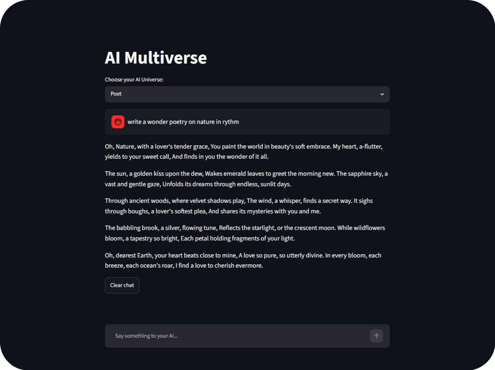

# AI Multiverse

A fun Streamlit app that lets you chat with different AI personalities (universes) powered by Google's Gemini 2.5‑Flash model.

## Features

- **Multiple personas**: Choose from a Wise Sage, a Sarcastic Robot, a Poet, or add your own.
- **Separate chat histories**: Each universe keeps its own conversation history.
- **Streaming responses**: See the AI "type" out its answer in real time.
- **Status updates**: Fun spinner messages while the AI cooks your response.
- **Clear chat**: Reset the conversation for the selected universe with one click.

## Demo



## Setup

1. **Clone / copy the repository** (or just the `assignment-2` folder).

2. **Create a virtual environment** (optional but recommended):
   ```bash
   python -m venv .venv
   .\.venv\Scripts\activate   # Windows
   # source .venv/bin/activate  # macOS/Linux
   ```

3. **Install dependencies**:
   ```bash
   pip install -r requirements.txt
   ```

4. **Set your Google AI API key**:
   - Copy the example file and rename it to `.env`:
     ```bash
     copy assignment-2\.env.example assignment-2\.env   # Windows CMD
     # or
     cp assignment-2/.env.example assignment-2/.env    # Unix
     ```
   - Edit `.env` and add your actual Gemini API key:
     ```
     API_KEY=your_actual_gemini_api_key_here
     ```
   - Alternatively, export the variable in your shell:
     ```bash
     setx API_KEY "your_actual_gemini_api_key_here"   # Windows CMD
     # or in PowerShell: $env:API_KEY="your_actual_gemini_api_key_here"
     ```

5. **Run the app**:
   ```bash
   streamlit run app.py
   ```
   The app will open at `http://localhost:8501` (or another port if specified).

## Usage

- Select a universe from the dropdown.
- Type your message in the chat box and press Enter.
- Watch the AI respond with its unique style.
- Use the **Clear chat** button to start fresh.

## Custom Personas

Edit the `PERSONAS` dictionary in `app.py`. Each entry is a name mapped to a system‑prompt string that defines the AI's tone.

## Extending

- **Add more personas**: Edit the `PERSONAS` dictionary in `app.py`.
- **Change the model**: Replace `"gemini-2.5-flash"` with another Gemini model name if you have access.
- **Persist chats**: Serialize `st.session_state.chat_histories` to a JSON file on disk if you want conversations to survive restarts.
- **Add avatars**: Store small image files and pass them to `st.chat_message(..., avatar="path/to/img.png")`.

## Requirements

See `requirements.txt` for the exact versions used during development.

A fun Streamlit app that lets you chat with different AI personalities (universes) powered by Google's Gemini 2.5‑Flash model.

## Features

- **Multiple personas**: Choose from a Wise Sage, a Sarcastic Robot, a Poet, or add your own.
- **Separate chat histories**: Each universe keeps its own conversation history.
- **Streaming responses**: See the AI "type" out its answer in real time.
- **Status updates**: Fun spinner messages while the AI cooks your response.
- **Clear chat**: Reset the conversation for the selected universe with one click.

## Setup

1. **Clone / copy the repository** (or just the `assignment-2` folder).

2. **Create a virtual environment** (optional but recommended):
   ```bash
   python -m venv .venv
   .\.venv\Scripts\activate   # Windows
   # source .venv/bin/activate  # macOS/Linux
   ```

3. **Install dependencies**:
   ```bash
   pip install -r requirements.txt
   ```

4. **Set your Google AI API key**:
   - Create a file named `.env` in the `assignment-2` folder with:
     ```
     API_KEY=your_actual_gemini_api_key_here
     ```
   - Or export the variable in your shell:
     ```bash
     setx API_KEY "your_actual_gemini_api_key_here"   # Windows CMD
     # or in PowerShell: $env:API_KEY="your_actual_gemini_api_key_here"
     ```

5. **Run the app**:
   ```bash
   streamlit run app.py
   ```
   The app will open at `http://localhost:8501` (or another port if specified).

## Usage

- Select a universe from the dropdown.
- Type your message in the chat box and press Enter.
- Watch the AI respond with its unique style="Clear chat** to start fresh.

## Custom Personas

Edit the `PERSONAS` dictionary in `app.py`st.status`** will show a sequence of messages:
  1. "Let me cook..."
  2. "I'm cooking the response..."
  3. "yoooo" (when the response is complete)
- The assistant's answer streams into the chat bubble.
- Use the **Clear chat** button to reset the conversation for the current universe.

## Extending

- **Add more personas**: Edit the `PERSONAS` dictionary in `app.py`. Each entry is a name mapped to a system‑prompt string that defines the AI's tone.
- **Change the model**: Replace `"gemini-2.5-flash"` with another Gemini model name if you have access.
- **Persist chats**: Serialize `st.session_state.chat_histories` to a JSON file on disk if you want conversations to survive restarts.
- **Add avatars**: Store small image files and pass them to `st.chat_message(..., avatar="path/to/img.png")`.

## Requirements

See `requirements.txt` for the exact versions used during development.

## License

This project is for educational / demo purposes. Feel free to modify and share.